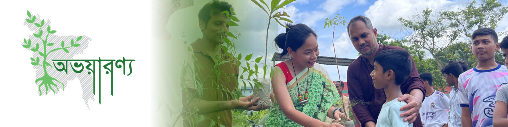

---
hide:
  - toc
  - navigation
---

  
  <h1>Avayaranya Nature Conservation Foundation (ANCF)</h1>
  
<strong>Conservation of endangered trees, native fruit species, biodiversity, and climate action.</strong>

  
<em>A nonprofit working across Bangladesh since 2013.</em>

---

## About ANCF

**Avayaranya Nature Conservation Foundation (ANCF)**, also know as *Avayaranya* (*অভয়ারণ্য*) is a nonprofit organisation founded in 2013 as a consortium of foresters and environment enthusiasts. Avayaranya is registed under the Societies Registration Act, 1860 (No. S-13827/2022) of the Government of Bangladesh. We work across Bangladesh on the conservation of endangered trees, native fruit species, biodiversity, and climate action through community-led
plantation, tree tagging, mapping, outreach, and applied research.

Over the past decade we have organised plantation, awareness, and research activities across more than ten districts of Bangladesh - from urban campuses in Dhaka to remote hill communities in Bandarban and Rangamati -in partnership with universities, schools, religious institutions, local nurseries, and youth groups.

  

---

[Explore Our Projects :material-arrow-right:](projects/index.md){ .md-button .md-button--primary }
[What We Do](what-we-do.md){ .md-button }
[Contact Us](contact.md){ .md-button }

---

## At a Glance

2013
Founded

10+
Districts reached

50+
Plantation projects

11,000+
Seedlings planted &amp; distributed

<small>*Cumulative figures derived from the [ANCF project history (2013–present)](assets/images/ancf_%20project%20history.pdf) and the [one-pager summary](assets/images/ancf_%20one%20pager.png). Update as new annual data is added.*</small>

---

## What We Do

-   :material-tree:{ .lg .middle } **Community Plantation**

    ---

    Native and endangered tree species planted with schools, colleges,
    universities, religious institutions, and local communities. Seedlings
    are also distributed for household and roadside planting.

    [Read more →](projects/community-plantation.md)

-   :material-tag-multiple:{ .lg .middle } **Tree Tagging**

    ---

    Tagging and labelling individual trees on campuses and in public spaces
    to support identification, monitoring, and environmental education.

    [Read more →](projects/tree-tagging.md)

-   :material-map-search:{ .lg .middle } **Mapping**

    ---

    Spatial mapping of endangered plants and habitats across Bangladesh
    to inform conservation priorities and restoration planning.

    [Read more →](projects/mapping-endangered-plants.md)

-   :material-leaf:{ .lg .middle } **Forest Bathing**

    ---

    Guided nature-immersion programmes to reconnect urban participants
    with forests and build a public constituency for conservation.

    [Read more →](projects/forest-bathing.md)

-   :material-flask-outline:{ .lg .middle } **Science in Conservation**

    ---

    Applying tools such as i-Tree, remote sensing, and species inventories
    to quantify ecosystem services and guide field interventions.

    [Read more →](projects/science-in-conservation.md)

-   :material-account-group:{ .lg .middle } **Community Awareness**

    ---

    School visits, book-fair stalls, and campus events that build
    awareness on biodiversity, climate change, and the role of native
    species.

    [Read more →](what-we-do.md)

---

## Latest Stories

**[Mapping Endangered Plants in Bangladesh](stories/mapping-endangered-plants.md)**

Why a national spatial inventory of endangered tree species is the
foundation of every restoration effort that follows.

[Read story →](stories/mapping-endangered-plants.md){ .md-button }

**[Plantation and Forest Landscape Restoration](stories/plantation-and-forest-landscape-restoration.md)**

What a decade of community plantation has taught us about which species
survive, which die, and what changes from one year to the next.

[Read story →](stories/plantation-and-forest-landscape-restoration.md){ .md-button }

**[Tree Tagging and Prospects](stories/tree-tagging-and-prospects.md)**

How simple labels on campus trees turn into datasets, conversations,
and a new generation of botanists.

[Read story →](stories/tree-tagging-and-prospects.md){ .md-button }

**[Forest Bathing and Bangladesh](stories/forest-bathing-and-bangladesh.md)**

Bringing the practice of *shinrin-yoku* to Bangladeshi forests — and
why slow, sensory time outdoors matters for conservation.

[Read story →](stories/forest-bathing-and-bangladesh.md){ .md-button }

---

## Connect

[Facebook](https://www.facebook.com/Avayaranyapage){ .md-button }
[Email](mailto:info@avayaranya.org){ .md-button }
[Contact Page](contact.md){ .md-button }
